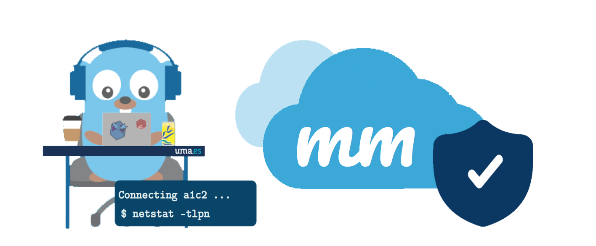

# MarshMallows

  

 

  <a href="https://slides.com/alvarvrandkode/mmallows/fullscreen?token=s_VTj2I7">PRESENTACIÓN ONLINE</a>

Solución de infraestructuras de red que permite que varias nubes privadas sean visibles entre sí, y que permite la gestión y una comunicación segura entre dispositivos conectados, principalmente de tipo IoT. Viene reforzada con mecanismos de seguridad ligeros y autenticación por doble factor 2FA o con claves físicas U2F.

## Descripción
MarshMallows es un proyecto basado en computación en la nube que proporciona una solución tipo Platform as a Service para la gestión y comunicaciones seguras de dispositivos IoT. La infraestructura se refuerza con mecanismos de seguridad ligeros y autenticación por doble factor (2FA) o con claves físicas (U2F). Además, permite asociarse con otras nubes desplegadas en la misma red, permitiendo la comunicación y visualización de dispositivos, acorde a los privilegios definidos.

Cada solución se despliega como una "mini-cloud", que permitiría realizar funciones típicas de una nube o plataforma del que penden dispositivos de tipo IoT, principalmente. Pueden llegar a estar instalados en diferentes infraestructuras de red y que a la vez sean visibles entre sí.

Su objetivo es permitir el acceso por SSH a los dispositivos conectados a cualquier punto de la infraestructura, ofreciendo la posibilidad de utilizar tanto la clásica consola de comandos como una interfaz web. Para proporcionar una mayor ayuda en la gestión de las máquinas, los usuarios no tendrían la necesidad de conocer direcciones IP que podrían cambiar con el tiempo. Todos los dispositivos estarían catalogados con identificadores alfanuméricos, y sus direcciónes IP quedan registradas en un servicio intermediario (_broker_), encargado de verificar los permisos de acceso y de establecer las comunicaciones entre máquinas.

Como prueba de concepto, cada plataforma desplegada proporciona una distribución Debian personalizada, que se instalará en dispositivos Raspberry Pi. También podría incluirse una versión instalable para dispositivos de baja latencia de tipo _Thingy_ que fuera compatible con la plataforma.

Es una solución ideal que permite gestionar y separar por dominios estos dispositivos con funcionalidades concretas o criterios elegidos por los administradores.

  

## Objetivos
MarshMallows cuenta con tres objetivos principales:

1.- Administrar de manera versátil los dispositivos registrados en distintas soluciones sin necesidad de ser identificados en la red.

2.- Permitir la gestión via SSH entre dispositivos o desde el portal web proporcionado. Esto requiere de la implementación de un broker que permita un enlace protegido extremo a extremo.

3.- Conectar varios nodos de MarshMallows para acceder y tener visible los dispostivos. Las mini-nubes se pueden interconectar mediante mecanismo web-hook, permitiendo vincular las comunicaciones entre los brokers y el acceso a los usuarios.

## Ventajas
**Coste**: Aprovisionamiento ligero sin coste adicional.

**Escalabilidad y flexibilidad**: El servicio reconoce automaticamente nuevos elementos en la red y les asigna un nombre, para ofrecer la conexion a los usuarios.

**Independencia entre dispositivo y ubicación**: Acceso entre dispositivos sin necesidad de conocer la situación exacta en la red, lo que permite flexibilidad e independencia de los mismos.

**Rendimiento**. Los mecanismos de comunicación son ligeros y seguros a la vez, permitiendo al dispositivo aprovechar la mayor parte de sus recursos en su tarea principal

**Seguridad**. Las comunicaciones quedan centralizadas mediante la implementación de un bróker que permite el enlace por canales ligeros y seguros entre los dispositivos. Además, ofrece protección por los mecanismos Protocol Noise Framework y cifrado Diffie-Hellman extremo a extremo.

**Mantenimiento**. Las distribuciones son personalizadas en el ámbito de la nube desplegada pero puede ser configuradas. Los dispositivos pueden moverse de una nube a otra y reasignárseles una IP diferente sin que lo note el usuario final.

## Aspectos diferenciadores
**Autenticación reforzada**: Implementación del acceso por claves físicas mediante Yubico/FIDO keys (U2F) o con OTPs

Solución **aplicable a cualquier infraestructura**, tanto para redes fisicas como locales o mediante contenedores Docker.

**Comunicaciones seguras mediante NPF** ([Noise Protocol Framework](http://www.noiseprotocol.org/)) permitiendo obviar overhead de las soluciones seguras TLS con claves pesadas.

Designación de alias o **identificadores para los elementos de la red**,  ajustados por la identificación de la nube y del dispositivo (nube_id.dispositivo_id[.servicio_id]). Por ejemplo "d1d00a.5g0a" o "d1d00a.5g0a.ssh"

## Tecnologías
- Go y Ruby (Back-end)
- Redis & MySQL (Base de datos)
- Rails (Framework web)
- React (Front-end)
- Google Authenticator (2FA)
- Yubico/FIDO Keys (U2F)
