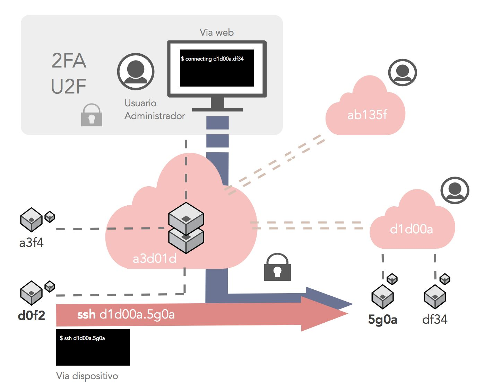

# MarshMallows

  

Solución de infraestructuras de red que permite que varias nubes privadas sean visibles entre sí, y que permite la gestión y una comunicación segura entre dispositivos conectados, principalmente de tipo IoT. Viene reforzada con mecanismos de seguridad ligeros y autenticación por doble factor 2FA o con claves físicas U2F.

## Descripción

MarshMallows es un proyecto basado en computación en la nube que proporciona una solución tipo Platform as a Service para la gestión y comunicaciones seguras de dispositivos IoT. La infraestructura se refuerza con mecanismos de seguridad ligeros y autenticación por doble factor (2FA) o con claves físicas (U2F). Además, permite asociarse con otras nubes desplegadas en la misma red, permitiendo la comunicación y visualización de dispositivos, acorde a los privilegios definidos.

Cada solución se despliega como una "mini-cloud", que permitiría realizar funciones típicas de una nube o plataforma del que penden dispositivos de tipo IoT, principalmente. Pueden llegar a estar instalados en diferentes infraestructuras de red y que a la vez sean visibles entre sí.

Su objetivo es permitir el acceso por SSH a los dispositivos conectados a cualquier punto de la infraestructura, ofreciendo la posibilidad de utilizar tanto la clásica consola de comandos como una interfaz web. Para proporcionar una mayor ayuda en la gestión de las máquinas, los usuarios no tendrían la necesidad de conocer direcciones IP que podrían cambiar con el tiempo. Todos los dispositivos estarían catalogados con identificadores alfanuméricos, y sus direcciónes IP quedan registradas en un servicio intermediario (_broker_), encargado de verificar los permisos de acceso y de establecer las comunicaciones entre máquinas.

Como prueba de concepto, cada plataforma desplegada proporciona una distribución Debian personalizada, que se instalará en dispositivos Raspberry Pi. También podría incluirse una versión instalable para dispositivos de baja latencia de tipo _Thingy_ que fuera compatible con la plataforma.

Es una solución ideal que permite gestionar y separar por dominios estos dispositivos con funcionalidades concretas o criterios elegidos por los administradores.

  

## Tecnologías
- Go y Ruby (Back-end)
- Redis & MySQL (Base de datos)
- Rails (Framework web)
- React (Front-end)
- Google Authenticator (2FA)
- Yubico/FIDO Keys (U2F)
